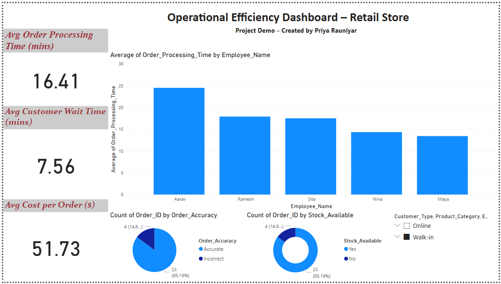

# Operational Efficiency Dashboard – Retail Store

## Project Overview

This project focuses on analyzing and improving operational performance in a retail store using business analytics. It includes data cleaning using Python and the development of an interactive Power BI dashboard. The goal is to help decision-makers monitor KPIs and optimize internal processes.

---

## Tools & Technologies Used

- Python (pandas, openpyxl)
- Power BI
- Microsoft Excel
- GitHub

---
## Dashboard Preview

Below is a snapshot of the final Power BI dashboard highlighting KPIs, employee performance, order accuracy, and stock availability.

---
## Dashboard Features

The Power BI dashboard includes the following components:

- **KPI Cards**
  - Average Order Processing Time (in minutes)
  - Average Customer Wait Time (specific to walk-in customers)
  - Average Cost per Order

- **Bar Chart**
  - Average order processing time per employee

- **Pie Charts**
  - Distribution of order accuracy (Accurate vs. Inaccurate)
  - Stock availability (Yes vs. No)

- **Slicers**
  - Filters for Customer Type, Product Category, and Employee Name

---

## Python Script – `BA.py`

The Python script performs the following tasks:

- Loads the original retail dataset from Excel
- Handles missing values and ensures proper data types
- Creates new columns:
  - `Total_Time`: Sum of processing and wait time
  - `Is_Efficient`: Logical column indicating if the total time is within an acceptable threshold
- Exports a cleaned version of the dataset for use in Power BI

---

## Files Included

| File Name                               | Description                                               |
|----------------------------------------|-----------------------------------------------------------|
| `BA.py`                                | Python script for data preprocessing                      |
| `Retail_Store_Operational_Data.xlsx`   | Raw dataset                                               |
| `Cleaned_Retail_Operational_Data.xlsx` | Cleaned dataset ready for visualization                   |
| `Operational_Efficiency_Dashboard_Retail.pbix` | Power BI dashboard file                            |
| `PDF of the dashboard.pdf`             | Exported version of the dashboard                         |
| `requirements.txt`                     | Required Python packages (`pandas`, `openpyxl`)           |

---

## Business Impact

This dashboard enables retail operations teams to:

- Pinpoint inefficiencies in employee workflows
- Track performance trends across customer types
- Maintain stock levels to minimize fulfillment delays
- Improve order accuracy and reduce operational costs
- Focus on walk-in customer experience where waiting time is a key concern

---

## Project Outcomes

- Created a clean, business-ready dashboard with real-time filtering options
- Demonstrated the use of Python and Power BI together in an analytics pipeline
- Built a replicable model for analyzing operational metrics in retail environments

